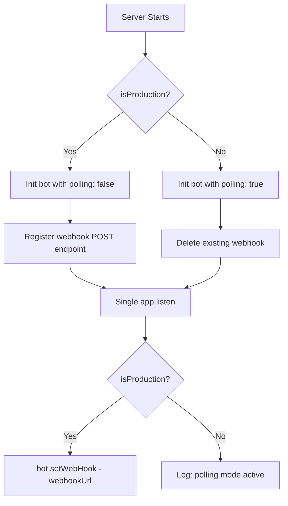
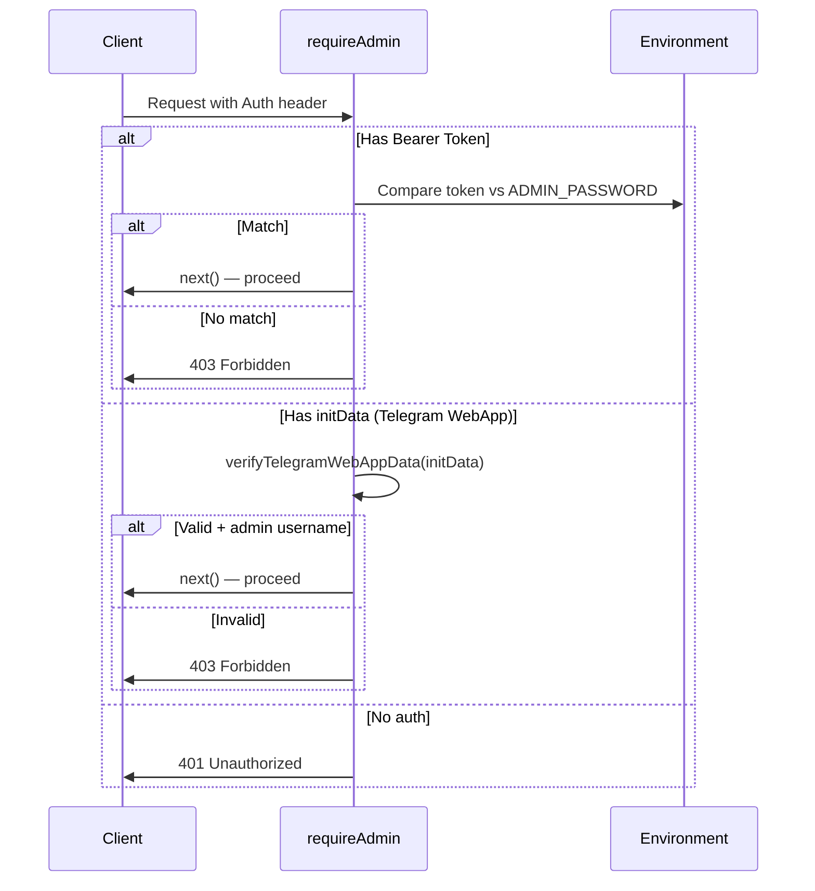

I have created the following plan after thorough exploration and analysis of the codebase. Follow the below plan verbatim. Trust the files and references. Do not re-verify what's written in the plan. Explore only when absolutely necessary. First implement all the proposed file changes and then I'll review all the changes together at the end.

# Implementation Plan — PepePuffBot Code Review Fixes

## Observations

The codebase has **critical server-crash bugs**: 4 `app.listen()` calls in `file:bot.js` (lines 339, 359, 366, 387), a dual polling+webhook conflict, undefined `isProduction` variable, duplicate `deleteWebHook` calls, and orphaned code after line 358. The admin API at `/admin/api/*` has zero authentication — `requireAdmin` trusts client-supplied `telegram_username`. The `saveUser()` uses `INSERT OR REPLACE` destroying row metadata. Frontend has competing checkout handlers (inline `onclick` + `addEventListener`). SQLite file storage will be lost on Railway redeploys.

## Approach

I will organize changes by file, resolving interdependent issues together (e.g., all `bot.js` changes at once). For the bot transport, I'll implement environment-based conditional mode (webhook in production, polling in development). For database persistence, I'll use **Option B (Railway Volumes)** as it's the least disruptive. For admin auth, I'll implement server-side password verification with the existing `verifyTelegramWebAppData` function. The `@dotlottie/player-component` will be pinned to `2.7.12`.

---

## Step 1 — Fix `file:bot.js` (Server Crash, Transport, Caching, Body Limit, Auth)

This step resolves **Comments 1, 4** (first batch), **Comments 1, 2** (second batch), and **Comment 1** (third batch).

### 1.1 — Add missing imports at the top of the file

- Add `const crypto = require('crypto');` to the existing imports
- Add `const { saveUser, saveOrder } = require('./database');` — these are referenced in the `web_app_data` handler (line 278, 288) but only inline-imported in other routes

### 1.2 — Define `isProduction` and conditionally initialize the bot

- After the `port` variable (line 20), add: `const isProduction = process.env.NODE_ENV === 'production';`
- **Replace line 23** (`new TelegramBot(token, { polling: true })`) with conditional initialization:
  - If `isProduction`: `new TelegramBot(token, { polling: false })`
  - Else: `new TelegramBot(token, { polling: true })`

### 1.3 — Remove duplicate `deleteWebHook` and simplify

- **Keep** the first `bot.deleteWebHook()` block (lines 27–31) — but wrap it in a condition so it only runs in **non-production** (polling) mode
- **Delete** the second duplicate `bot.deleteWebHook()` block (lines 33–38) entirely

### 1.4 — Reduce JSON body limit

- Change line 78 from `express.json({ limit: '10mb' })` to `express.json({ limit: '100kb' })`

### 1.5 — Fix conflicting caching strategy

- **Delete** the `/static` middleware block (lines 62–66) — it's never used by the frontend
- **Delete** the no-cache middleware block (lines 69–76) — HTTP headers from the server are sufficient
- Keep the main `express.static` on line 79 as-is (or add a sensible `maxAge` if desired)

### 1.6 — Add authentication to admin router mount

- Change line 87 from `app.use('/admin', adminRouter)` to `app.use('/admin', requireAdmin, adminRouter)`
- Exclude the admin static page serving from auth if needed (the `admin/index.html` page itself should be accessible to show the login form)

### 1.7 — Use a secure webhook path

- In the webhook block (line 328), replace `const webhookPath = '/bot${token}'` with a random path:
  `const webhookPath = '/webhook/' + crypto.randomBytes(16).toString('hex');`
- Update the `bot.setWebHook()` call in the `app.listen` callback to use this new path

### 1.8 — Remove all orphaned/duplicate code from line 358 onward

- **Delete lines 358–392 entirely** — this includes:
  - Duplicate `app.listen()` at lines 359, 366, 387
  - Orphaned `orderMessage` builder at lines 372–384
  - These are leftover copy-paste artifacts

### 1.9 — Keep exactly ONE `app.listen()` call

- Keep the `app.listen` at line 339 as the single entry point
- Inside its callback, conditionally set up webhook (production) or log polling mode (development)
- The existing structure at lines 339–356 is correct for this — just ensure lines 358+ are deleted



---

## Step 2 — Fix `file:admin.js` (module.exports Placement)

### 2.1 — Move `module.exports` to the end of the file

- **Delete** `module.exports = router;` from line 59
- **Delete** the blank lines 60–61
- **Add** `module.exports = router;` at the very end of the file, after line 136
- All routes (lines 18–136) remain as-is — they are already properly defined and not duplicated

---

## Step 3 — Fix `file:database.js` (Upsert + Persistence Path)

### 3.1 — Replace `INSERT OR REPLACE` with proper upsert in `saveUser()`

- Replace the SQL statement in `saveUser()` (lines 46–49) with:
  ```sql
  INSERT INTO users (telegram_id, telegram_username, name, city, phone, photo_url)
  VALUES (?, ?, ?, ?, ?, ?)
  ON CONFLICT(telegram_id) DO UPDATE SET
    telegram_username = excluded.telegram_username,
    name = excluded.name,
    city = excluded.city,
    phone = excluded.phone,
    photo_url = excluded.photo_url
  ```
- The `run()` parameters (lines 50–57) remain unchanged

### 3.2 — Use volume-based path for SQLite database

- Change line 2 from `new Database('pepepuff.db')` to use an environment-aware path:
  - Read from `process.env.DATABASE_PATH || 'pepepuff.db'`
  - In production (Railway), set `DATABASE_PATH=/data/pepepuff.db` via environment variable
  - This allows local development to keep using `pepepuff.db` in the project root

### 3.3 — Update `file:railway.json` for Railway Volume

- Add volume configuration. Note: Railway Volumes are configured via the Railway dashboard (not `railway.json`), so add a comment in `file:DEPLOY.md` or `file:README.md` documenting:
  - Create a volume in Railway dashboard
  - Mount it to `/data`
  - Set env var `DATABASE_PATH=/data/pepepuff.db`

---

## Step 4 — Fix `file:public/index.html` (Checkout, Lottie, Cache Meta)

### 4.1 — Remove `onclick` from checkout button

- Change line 124 from:
  `<button id="checkoutBtn" class="btn-checkout" onclick="handleCheckout()">Оформить заказ</button>`
  to:
  `<button id="checkoutBtn" class="btn-checkout">Оформить заказ</button>`

### 4.2 — Pin `@dotlottie/player-component` version

- Change line 15 from `@latest` to `@2.7.12`:
  `https://unpkg.com/@dotlottie/player-component@2.7.12/dist/dotlottie-player.mjs`

### 4.3 — Remove meta cache-control tags

- **Delete** lines 9–11 (the three `<meta http-equiv="Cache-Control">`, `Pragma`, and `Expires` tags)
- HTTP headers from the Express server take precedence over these meta tags

---

## Step 5 — Fix `file:public/app.js` (Checkout Handler, localStorage)

### 5.1 — Replace `localStorage.clear()` with targeted removal

- Replace line 48 (`localStorage.clear()`) with targeted key removal:
  - Iterate `Object.keys(localStorage)` and remove only keys belonging to this app
  - Target keys matching: starts with `user_`, equals `lastActivePage`, or equals `admin_password`
  - Use `.filter(...).forEach(key => localStorage.removeItem(key))`

### 5.2 — Remove duplicate checkout `addEventListener` block

- **Delete** lines 543–581 entirely — this is the duplicate checkout handler that uses `tg.sendData()` (the old approach)
- The `window.handleCheckout` function (lines 99–216) is the correct handler that uses the `/api/orders` fetch approach

### 5.3 — Attach checkout handler cleanly inside `DOMContentLoaded`

- Inside the `DOMContentLoaded` handler (after line 612 where `updateCart()` is called), add:
  `document.getElementById('checkoutBtn').addEventListener('click', handleCheckout);`
- This replaces both the deleted `onclick` attribute and the deleted duplicate `addEventListener`

---

## Step 6 — Fix `file:public/pull-to-refresh.js` (Touch Performance)

### 6.1 — Implement two-phase touch listener approach

In the `attachEvents()` method (starting at line 39):

1. **Keep `touchstart` as passive** (line 43, already correct) — but add a minimum threshold check: do NOT set `this.isDragging = true` immediately. Instead, just record `startY`

2. **Register `touchmove` conditionally**: In `touchstart`, if `window.scrollY === 0`, store `startY` and set a flag like `this.watching = true`. Register a **non-passive** `touchmove` listener only at this point

3. **Add 10px vertical threshold**: In the `touchmove` handler, only set `this.isDragging = true` once `diff > 10` (currently `e.preventDefault()` is called at `diff > 10` but `isDragging` is set immediately at `scrollY === 0`)

4. **Remove `touchmove` listener in `touchend`**: In the `touchend` handler, remove the non-passive `touchmove` listener to avoid lingering handlers

5. **Add `will-change: transform`**: In the `init()` method, add `refreshContainer.style.willChange = 'transform'` to the created element for GPU-accelerated animations

---

## Step 7 — Fix `file:middleware/auth.js` (Admin Authentication)

### 7.1 — Rewrite `requireAdmin` for server-side verification

Replace the current `requireAdmin` function (lines 26–38) with proper verification:

1. **Check for Bearer token** in the `Authorization` header — this handles the `admin/index.html` standalone panel
2. **Check for Telegram `initData`** — use the existing `verifyTelegramWebAppData()` function (lines 4–23) to verify the data, then extract the username from the verified payload
3. **For the Bearer token path**: Compare the provided password against a hashed admin password stored in environment variables (e.g., `ADMIN_PASSWORD`). Use `crypto.timingSafeEqual` for comparison or add `bcrypt` (already referenced in `file:config/constants.js` at line 45 with `BCRYPT_ROUNDS: 12`)
4. **Do NOT trust** `req.body.telegram_username` or `req.query.telegram_username` — remove these lines entirely

### 7.2 — Add admin password environment variable

- Add `ADMIN_PASSWORD` to `file:.env.example`
- In `requireAdmin`, verify the Bearer token against this hashed password
- The `admin/index.html` login flow sends `Authorization: Bearer ${password}` — this password should be verified server-side against the env var



---

## File Change Summary

| File | Changes |
|------|---------|
| `file:bot.js` | Add imports (`crypto`, `saveUser`, `saveOrder`), define `isProduction`, conditional bot init, remove duplicate `deleteWebHook`, reduce JSON limit, remove `/static` + no-cache middleware, add auth to admin mount, secure webhook path, delete lines 358–392 |
| `file:admin.js` | Move `module.exports = router;` from line 59 to end of file |
| `file:database.js` | Replace `INSERT OR REPLACE` with `ON CONFLICT...DO UPDATE SET` in `saveUser()`, use env-based DB path |
| `file:public/index.html` | Remove `onclick` from checkout button, pin lottie to `@2.7.12`, remove cache meta tags |
| `file:public/app.js` | Replace `localStorage.clear()` with targeted removal, delete duplicate checkout handler (lines 543–581), add clean `addEventListener` in `DOMContentLoaded` |
| `file:public/pull-to-refresh.js` | Two-phase touch listeners, 10px drag threshold, remove listener on `touchend`, add `will-change: transform` |
| `file:middleware/auth.js` | Rewrite `requireAdmin` with server-side password/initData verification |
| `file:.env.example` | Add `ADMIN_PASSWORD` variable |
| `file:README.md` or `file:DEPLOY.md` | Document Railway Volume setup for SQLite persistence |